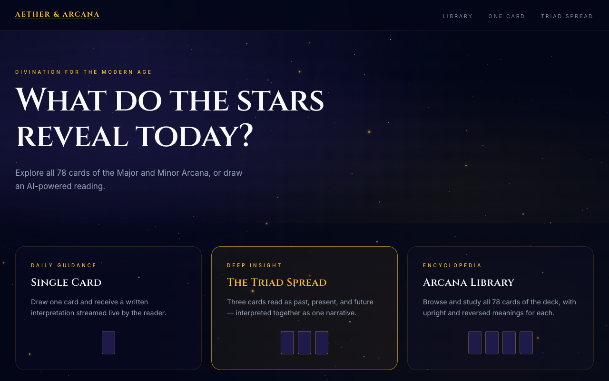
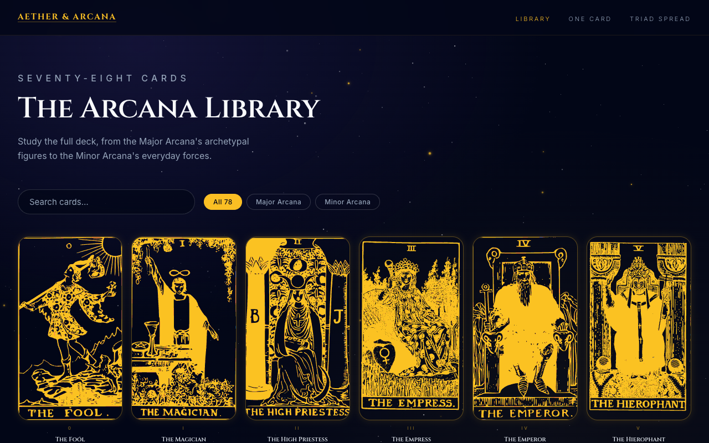
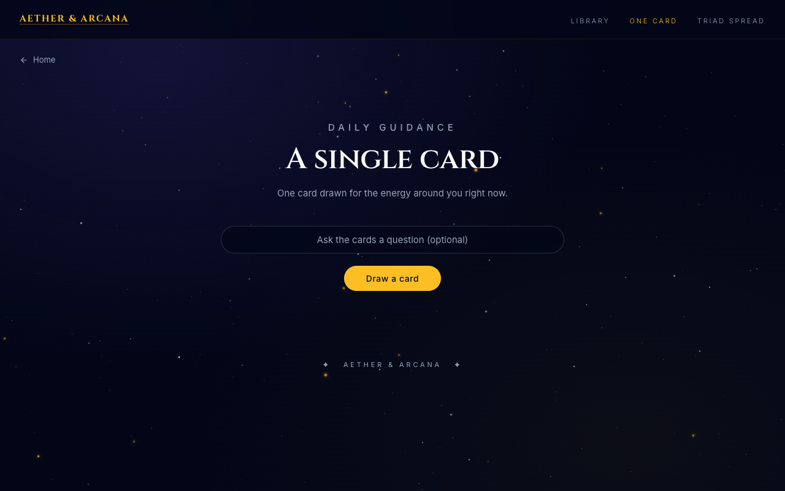
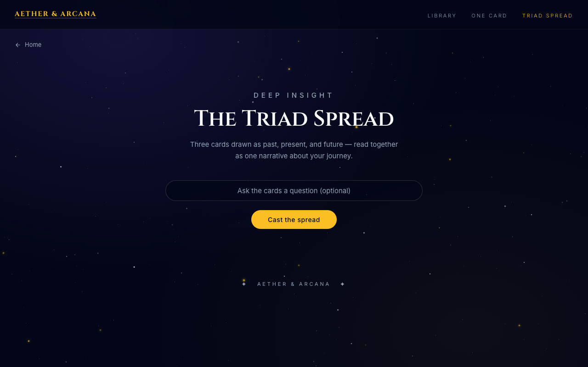
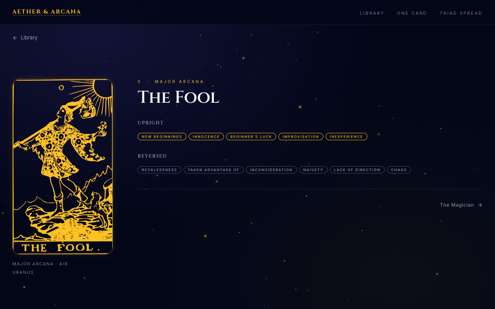

# Aether & Arcana

Tarot divination for the modern age. A Flask app with three core features:

1. **Single Card** — draw one card and get an AI-powered witchy interpretation streamed live.
2. **Triad Spread** — draw three cards read together as past, present, and future in one narrative.
3. **Arcana Library** — browse and search all 78 cards of the Major and Minor Arcana, with upright and reversed meanings.

Each card has a generated SVG image. Reversed draws show the art upside-down and overlay the reversed meaning text.

## Screenshots











## Run

1. Create and activate a virtual environment:

```bash
python -m venv .venv
source .venv/bin/activate   # Windows: .venv\Scripts\Activate.ps1
```

2. Install dependencies:

```bash
pip install -r requirements.txt
```

3. Configure the Anthropic API token (see below).

4. Start Flask locally:

```bash
python app.py
```

5. Start with Gunicorn for production-style deployment:

```bash
gunicorn app:app
```

6. Open http://127.0.0.1:8000

## AI readings

Readings stream from Anthropic Claude (`claude-haiku-4-5`). Set an `ANTHROPIC_TOKEN` environment variable, or add it to a local `.env` file (loaded automatically via `python-dotenv`):

```
ANTHROPIC_TOKEN=sk-ant-...
```

Without a token the reading pages still render, but the interpretation endpoint returns a friendly "reader unavailable" message instead of streaming text.

Reading behavior is driven by editable prompt files in `prompts/`:

- `reading_system.md` — the reader's system voice
- `one_card_user.md` — the single-card prompt
- `three_card_user.md` — the triad spread prompt

## Tests

```bash
python -m pytest
```

## Card art

Each card renders from an SVG under `static/cards`. Selected FreeSVG source URLs are recorded in `data/freesvg_card_sources.json`.
